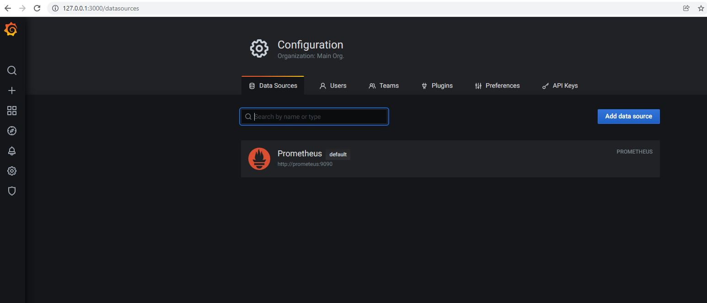
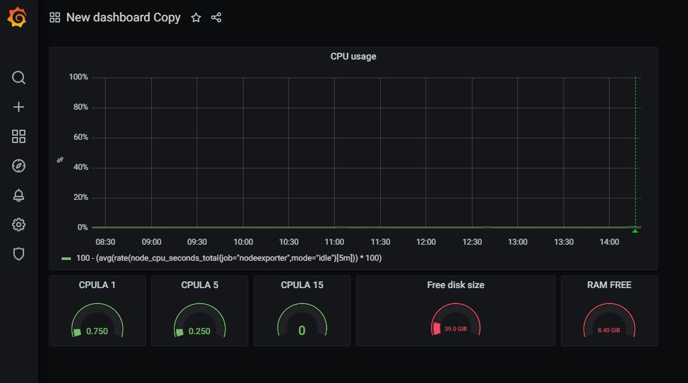
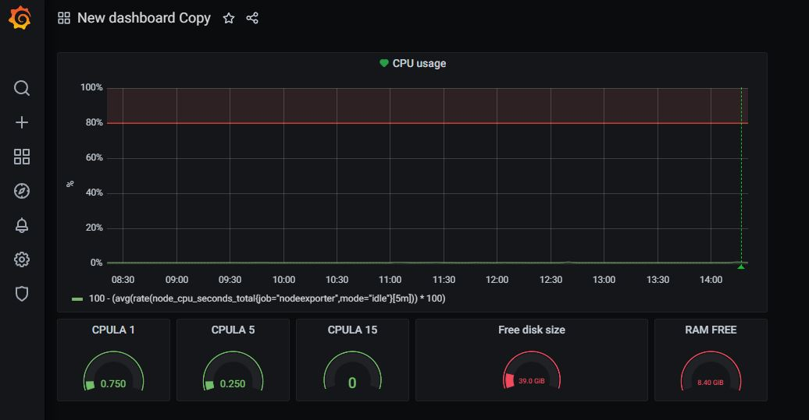

### Домашнее задание к занятию "10.03. Grafana"

#### Задание повышенной сложности

>**В части задания 1** не используйте директорию [help](./help) для сборки проекта, самостоятельно разверните grafana, где в
роли источника данных будет выступать prometheus, а сборщиком данных node-exporter:
>- grafana
>- prometheus-server
>- prometheus node-exporter
>
>За дополнительными материалами, вы можете обратиться в официальную документацию grafana и prometheus.
>
>В решении к домашнему заданию приведите также все конфигурации/скрипты/манифесты, которые вы
использовали в процессе решения задания.
>
>**В части задания 3** вы должны самостоятельно завести удобный для вас канал нотификации, например Telegram или Email
и отправить туда тестовые события.
>
>В решении приведите скриншоты тестовых событий из каналов нотификаций.


>#### Обязательные задания
>
>##### Задание 1
>Используя директорию [help](./help) внутри данного домашнего задания - запустите связку prometheus-grafana.
>
>Зайдите в веб-интерфейс графана, используя авторизационные данные, указанные в манифесте docker-compose.
>
>Подключите поднятый вами prometheus как источник данных.
>
>Решение домашнего задания - скриншот веб-интерфейса grafana со списком подключенных Datasource.



>#### Задание 2
>Изучите самостоятельно ресурсы:
>- [promql-for-humans](https://timber.io/blog/promql-for-humans/>#cpu-usage-by-instance)
>- [understanding prometheus cpu metrics](https://www.robustperception.io/>understanding-machine-cpu-usage)
>
>Создайте Dashboard и в ней создайте следующие Panels:
>- Утилизация CPU для nodeexporter (в процентах, 100-idle)
```
100 - (avg(rate(node_cpu_seconds_total{job="nodeexporter",mode="idle"}[5m])) * 100)
```
>- CPULA 1/5/15
```
avg(node_load1) / count(count(node_cpu_seconds_total) by (cpu)) * 100
avg(node_load5) / count(count(node_cpu_seconds_total) by (cpu)) * 100
avg(node_load15) / count(count(node_cpu_seconds_total) by (cpu)) * 100
```
>- Количество свободной оперативной памяти
```
node_memory_MemFree_bytes
```
>- Количество места на файловой системе
```
node_filesystem_avail_bytes{fstype!="tmpfs"}

```
>
>Для решения данного ДЗ приведите promql запросы для выдачи этих метрик, а также >скриншот получившейся Dashboard.



>## Задание 3
>Создайте для каждой Dashboard подходящее правило alert (можно обратиться к >первой лекции в блоке "Мониторинг").
>
>Для решения ДЗ - приведите скриншот вашей итоговой Dashboard.

Алерт привязал только к первому графику, т.к. для остальных типов графиков этого сделать не получилось.




>## Задание 4
>Сохраните ваш Dashboard.
>
>Для этого перейдите в настройки Dashboard, выберите в боковом меню "JSON MODEL".
>
>Далее скопируйте отображаемое json-содержимое в отдельный файл и сохраните его.
>
>В решении задания - приведите листинг этого файла.

[my_dashboard.json](my_dashboard.json)
