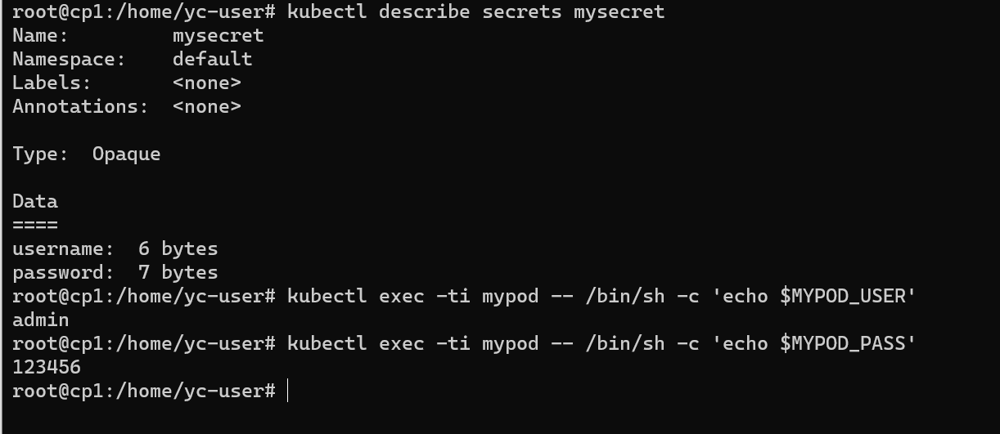

# Домашнее задание к занятию "14.1 Создание и использование секретов"

## Задача 1: Работа с секретами через утилиту kubectl в установленном minikube

Выполните приведённые ниже команды в консоли, получите вывод команд. Сохраните
задачу 1 как справочный материал.

### Как создать секрет?

```
openssl genrsa -out cert.key 4096
openssl req -x509 -new -key cert.key -days 3650 -out cert.crt \
-subj '/C=RU/ST=Moscow/L=Moscow/CN=server.local'
kubectl create secret tls domain-cert --cert=certs/cert.crt --key=certs/cert.key
```

### Как просмотреть список секретов?

```
kubectl get secrets
kubectl get secret
```

### Как просмотреть секрет?

```
kubectl get secret domain-cert
kubectl describe secret domain-cert
```


### Как получить информацию в формате YAML и/или JSON?

```
kubectl get secret domain-cert -o yaml
kubectl get secret domain-cert -o json
```


### Как выгрузить секрет и сохранить его в файл?

```
kubectl get secrets -o json > secrets.json
kubectl get secret domain-cert -o yaml > domain-cert.yml
```


### Как удалить секрет?

```
kubectl delete secret domain-cert
```

### Как загрузить секрет из файла?

```
kubectl apply -f domain-cert.yml
```


## Задача 2 (*): Работа с секретами внутри модуля

Выберите любимый образ контейнера, подключите секреты и проверьте их доступность
как в виде переменных окружения, так и в виде примонтированного тома.

Секрет в виде переменной окружения:



Секрет в виде тома:


Файлы подгрузил в каталог.
При подготовке ДЗ использовал оф документацию и статью https://ealebed.github.io/posts/2018/%D0%B7%D0%BD%D0%B0%D0%BA%D0%BE%D0%BC%D1%81%D1%82%D0%B2%D0%BE-%D1%81-kubernetes-%D1%87%D0%B0%D1%81%D1%82%D1%8C-14-%D1%81%D0%B5%D0%BA%D1%80%D0%B5%D1%82%D1%8B-secrets/


---

