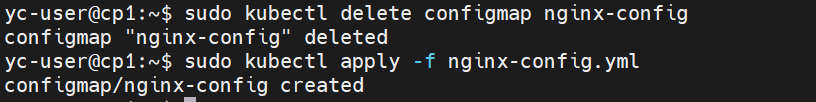

# Домашнее задание к занятию "14.3 Карты конфигураций"

## Задача 1: Работа с картами конфигураций через утилиту kubectl в установленном minikube

Выполните приведённые команды в консоли. Получите вывод команд. Сохраните
задачу 1 как справочный материал.

### Как создать карту конфигураций?

```
kubectl create configmap nginx-config --from-file=nginx.conf
kubectl create configmap domain --from-literal=name=netology.ru
```


### Как просмотреть список карт конфигураций?

```
kubectl get configmaps
kubectl get configmap
```


### Как просмотреть карту конфигурации?

```
kubectl get configmap nginx-config
kubectl describe configmap domain
```


### Как получить информацию в формате YAML и/или JSON?

```
kubectl get configmap nginx-config -o yaml
kubectl get configmap domain -o json
```


### Как выгрузить карту конфигурации и сохранить его в файл?

```
kubectl get configmaps -o json > configmaps.json
kubectl get configmap nginx-config -o yaml > nginx-config.yml
```


### Как удалить карту конфигурации?

```
kubectl delete configmap nginx-config
```

### Как загрузить карту конфигурации из файла?

```
kubectl apply -f nginx-config.yml
```



## Задача 2 (*): Работа с картами конфигураций внутри модуля

Выбрать любимый образ контейнера, подключить карты конфигураций и проверить
их доступность как в виде переменных окружения, так и в виде примонтированного
тома

---

Для пода mypod подключил карты конфигураций domain, а в виде тома - nginx-config -


```
apiVersion: v1
kind: Pod
metadata:
  name: mypod
spec:
  containers:
  - name: mypod
    image: nginx
    env:
      - name: NGINX_SERVER_NAME
        valueFrom:
          configMapKeyRef:
            name: domain
            key: name       
    volumeMounts:
      - name: config
        mountPath: /etc/nginx
        readOnly: true
  volumes:
  - name: config
    configMap: 
      name: nginx-config
```


