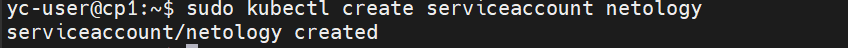
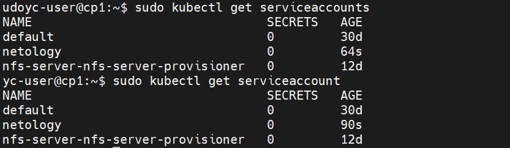
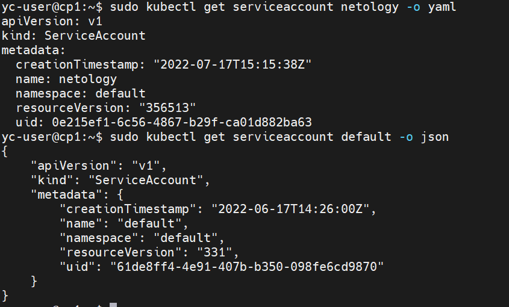
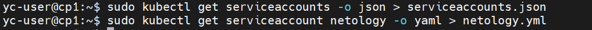
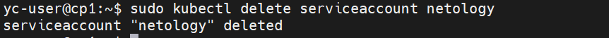
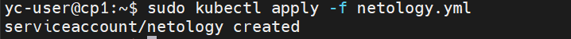

# Домашнее задание к занятию "14.4 Сервис-аккаунты"

## Задача 1: Работа с сервис-аккаунтами через утилиту kubectl в установленном minikube

Выполните приведённые команды в консоли. Получите вывод команд. Сохраните
задачу 1 как справочный материал.

### Как создать сервис-аккаунт?

```
kubectl create serviceaccount netology
```



### Как просмотреть список сервис-акаунтов?

```
kubectl get serviceaccounts
kubectl get serviceaccount
```



### Как получить информацию в формате YAML и/или JSON?

```
kubectl get serviceaccount netology -o yaml
kubectl get serviceaccount default -o json
```



### Как выгрузить сервис-акаунты и сохранить его в файл?

```
kubectl get serviceaccounts -o json > serviceaccounts.json
kubectl get serviceaccount netology -o yaml > netology.yml
```
Файлы приложены к репозиторию.


### Как удалить сервис-акаунт?

```
kubectl delete serviceaccount netology
```



### Как загрузить сервис-акаунт из файла?

```
kubectl apply -f netology.yml
```



